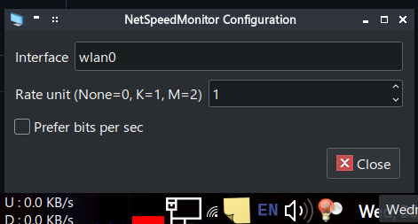

# lxNetSpeedMonitor
Show network speed by interface in lxpanel. Inspired by [NetSpeedMonitor](https://netspeedmonitor.net)

# building and installing
Install/update build dependencies.  
Arch:  
`sudo pacman -Sy cmake base-devel`  

Debian/Ubuntu and its derivatives:  
`sudo apt install cmake build-essential lxpanel-dev`  

If you are a cool kid not using the above distros, you probably know how to install the above development packages for your distro!

Build with CMake  
`cmake -S . -B build`  
`cmake --build build`

Find the plugins location:  
Usually:  
`/usr/lib/lxpanel/plugins` on Arch  
`/usr/lib/<PROCESSOR_ARCHITECTURE>/lxpanel/plugins` on Debian/Ubuntu and its derivatives  
**PROCESSOR_ARCHITECTURE can be x86_86 or i686 **

The folder should at least contain several *.so file which are the plugins like `weather.so, volume.so`, if not find it manually  

`find / 2>/dev/null -wholename "*/lxpanel/plugins"`  
This may take some time depending on the size of your file system  

Copy the build file to this directory:  
`sudo cp build/netspeedmonitor.so <PLUGINS_DIRECTORY>`  

# usage
- Right click on panel then Panel Settings
- Navigate to Panel Applets then click Add
- Double click NetSpeedMonitor

# configuration
- Right click the applet in the panel then settings
- Type in the interface you want to track usage

